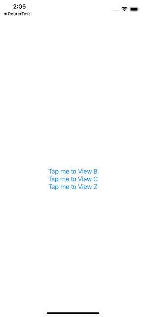

# SwiftUI-RouterDemo

This is a simplified demonstration to the approach of leaving view transition management to a router.

## Motivation

SwiftUI provides different ways of managing view transitions. If routers don't take part in your project, this approach... well, it works.

But if your project uses an architecture that may use an router, or simply you just want some component to manage the whole routing logics, default SwiftUI-way to manage view transitions is very tricky, because normally the properties to manage transition states will be all over the project.

So I came up with this approach that leaves the whole transition logics to the router, and views don't have to take any care of transitions. Neither does it need to know what next view is, nor does it need to handle the transition state flags. You can manage the whole transition logics just in ONE router (or several routers if you need).

## Goal

This is what I want to achieve in a view:

```swift:LoginView.swift
import SwiftUI

enum LoginViewRoute {
    case didLogin(profile: Profile)
    case loginFailure(reason: ErrorMessage)
}

protocol LoginViewRouterObject: AnyObject {
    func viewNeedsRoute(to route: LoginViewRoute)
}

protocol LoginViewAPIServiceObject: AnyObject {
    func login(id: String, password: String) -> AnyPublisher<Profile, ErrorMessage>
}

struct LoginView<Router: LoginViewRouterObject, APIService: LoginViewAPIServiceObject>: View {

    var router: Router
    var apiService: APIService
    
    @State private var id: String
    @State private var password: String
    
    @State private var tasks: Set<AnyCancellable> = []

    var body: some View {
        VStack {
            TextField("ID", text: $id)
            SecureField("Password", text: $password)
            Button {
                apiService.login(id: id, password: password)
// ---------------- ↓ Leaving routings to router
                    .sink { completion in
                        switch completion {
                        case .finished:
                            return
                        case .failure(let message):
                            router.viewNeedsRoute(to: .loginFailure(reason: message))
                        }
                    } receiveValue: { profile in
                        router.viewNeedsRoute(to: .didLogin(profile: profile))
                    }
// ---------------- ↑ Leaving routings to router
                    .store(in: &tasks)
                
            } label: {
                Text("Login")
            }
        }
    }
}
```

This sample code is a little bit long, but the key points are just between the 2 mark comments:

1. `LoginView` just tells the router that it has succeeded/failed to login
2. `LoginView` doesn't know how the transition will take place after it calls the router

So how can we achieve this goal?

## Details

Although the sample code of goal above is more like a real-world problem, it has too much information that can be noise when we just want to know how to make a transition-handling router. So in this demo project, the views are more simplified that they don't have async process, transitions will take place soon after tapping the buttons.

The key is that transition flags don't have to be `@State` properties in `View`s. All they need is A) observable by SwiftUI engine and B) bindable to transited view. So what we can do is:

1. Make the router `ObservableObject` and manage all transition flags `@Published`, so that when a flag is changed, the SwiftUI engine will catch that modification and re-render the views with proper transitions.
2. Manually make `Binding<Bool>`s as binding properties for views to transit with `NavigationLink` components or `.fullscreenOver` modifiers.
3. Make a new `ViewModifier` with all the flags so we don't have to manage the flags in our views.
4. Make the router, and attach the `ViewModifier`s made in step 3 from the router.

As you can see, step 1 and step 2 are easy to implement, so here I'd like to spend some time to explain how to do  step 3 and step 4.

### `RoutingModifier`

The `ViewModifier` introduced in step 3 is named `RoutingModifier` in this demo project. to implement it we have to declare an abstract `RouterObject` protocol. In this protocol we need to know 4 things: A) the `NavigationLink` push-transition flag binding, B) the view to push if push-transition flag is true, C) the `.fullScreenOver` modal-transition flag binding, and D) the view to present if modal-transition flag is true. Obviously not all views requires both push-transitions and modal-transitions, but as a general-purpose protocol we need to declare it at the first place, and for the views that don't have transitions, just return `.constant(false)` as  the flag binding, as `EmptyView()` as the view to transit.

After the protocol declared, just store it as `@ObservedObject` in the modifier. Since `ObservableObject` contains associated types, the `RouterObject` needs to be declared as a generic for `RoutingModifier` otherwise it can't be stored. 

Also since the `RouterObject` protocol is a general protocol that doesn't rely on any solid views, it needs some property to identify exactly which view is calling, so the router object can return the correct flags and views for transition. In this demo project I used a very simple `viewID: String` property to do the job, but you can use your imagination, like declaring a `ViewType` enum with all possible view cases as the `viewID`. This will be much better than using the general-purposed `String` type.

Now we can implement push-transitions via the `NavigationLink` and  `.fullScreenCover` via `body` method in `RoutingModifier`. Here we used a trick that adding a `NavigationLink` with `EmptyView` label as `.background` can hide the `NavigationLink` itself while still having the ability to control navigation transitions. Then if a view is attached with this modifier, it'll get the ability to observe whether it should navigate-to/present some view or not.

Finally, we can make a method to `View` so that we can attach the `RoutingModifier` to it. In this demo project `injectRouter` is the method to do the job.

### Router

The router introduced in step 4 is named `Router` in this demo project. It conforms to `ObservableObject` with transition flags marked as `@Published`, so if any transition flags has been changed, SwiftUI will be able to re-render and do the transition.

`Router` also needs to conform `RouterObject` declared from `RoutingModifier`, so we can attach `Router` to the modifier. In addition, obviously `Router` also needs to conform `RouterDelegate`s declared from each view so `Router` can know when and how to modify the transition flags.

Now, since making views is also `Router`'s responsibility, `Router` can attach itself to the views it made by `injectRouter` we made above, so that  solid views don't have to know anything about `Router`. All it needs is just a way to tell router its status is changed, maybe router may want to do a transition.

By the way, in this demo transition flags are declared as `ViewARoute?` and `ViewBRoute?` properties, but just like `viewID`s you can also use your imagination to make any types as transition flags, just make sure you can make `Binding<Bool>`s for each view's `RoutingModifier`.

## Demo



## P.S.

Please note that although `RouterObject` declared from `RoutingModifier` inherits `ObservableObject`, `RouterDelegate`s declared from each solid view only inherits `AnyObject`. That's because as a router delegate, the view just needs to tell the router it may want to do some transition flag modifications, but the view itself doesn't observe any properties. What observes the properties is the `RoutingModifier` attached by router. 

So technically if you're using an even more complex architecture that separates router to routing (i.e. Router), component-resolving (i.e. Resolver) and data-storing (i.e. Store), you're still able to use this approach, just need some improvements in `RoutingModifier` to store the components separately. I'll make a demo like that in [this repo](https://github.com/el-hoshino/ViDRep-Sample) in the future.
